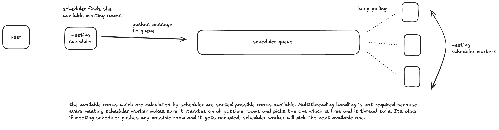

N rooms are given and streams of times will be given and we have to schedule meeting. After storing the meeting we have to store audit logs for each room. We have to delete audit logs after x days. Follow up questions were that rooms will have capactiy constraints so that we have to check if we can organise meeting with given capacity. Also we have to minimise spillage of free time while sceduling meetings.
